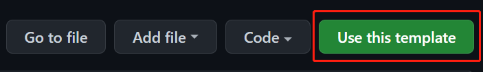

# userscript-typescript-template-kw

An opinionated template repo using Webpack and TypeScript to build your userscript for Tampermonkey and more extensions.

Based on [pboymt/userscript-typescript-template](https://github.com/pboymt/userscript-typescript-template).

## Features

### Styles support

Just write your styles in `src/assets/styles/styles.scss` and they will append in web page's `<head></head>`!

You can also add your own files with `.css` or `.scss` extension in `StylesInjecter` class.

### Splitted assets for different development workflow

The repository generates two different assets (files):

1. One is fully compiled (`index.user.js`);
2. The second (`index.hot-reload.user.js`) has userscript's meta info and reference to the first asset so you can copy and paste its entire code to Tampermonkey **once**.

This allows you faster updating scripts by automatically picking up recent changes.

### Better tooling support

The project has different classes to:
- Render, remove elements;
- Guards (which are TS decorators) that allow you to restrict method/function execution;
- HTML element finders;
- Build your own HTML elements declaratively.

## Usage

### 1. Generate repostiory (two-ways)

#### - Use this template to create your new repository



#### - Clone this repository

```powershell
# Use Github CLI
$ gh repo clone kenya-west/userscript-typescript-template-kw
# Or use 'git clone' command directly
$ git clone https://github.com/Kenya-West/userscript-typescript-template-kw.git
```

### 2. Development

1. Install dependencies with `npm ci`.
2. Edit settings in `userscript` object in [`package.json`](./package.json), you can refer to the comments in [`plugins/userscript.plugin.ts`](./plugins/userscript.plugin.ts).
3. Code your userscript in `src` directory (like [`src/index.ts`](./src/index.ts)).
4. Generate userscript with `npm run build` or `npm run build:watch` to auto-update resulting bundle on changes.
5. Copy generated userscript contents `index.hot-reload.user.ts` to **Tampermonkey** -> **Add new script**.

### 3. (Optional) Compile other file types

You need install other loader plugins to support other file types.

### 4. Debug

Allow Tampermonkey's access to local file URIs ([Tampermonkey FAQs](https://tampermonkey.net/faq.php?ext=dhdg#Q204)) and import built userscript's file URL. 

### 5. Publish you userscript

You can publish your userscript to [Greasy Fork](https://greasyfork.org/) or other websites.

You can push your userscript to [Github](https://github.com) and import it to [Greasy Fork](https://greasyfork.org/import).

## Roadmap

### Add proper DI, or prefer `static` classes

Currently, some classes need to be instantiated, some have static method. Choose one unified way to call them.

### Make repository-based method to store custom ids of elements

If you create elements, you need to remember which strings to use. You can confuse them. Make a way to pre-define and reuse strings of ids of custom HTML elements.

### Do we need abstract classes of custom elements?

Currently, to create a custom HTML element, you need to create an abstract class, then a base class, and then finally, final class of your element. Why do we need 3 steps to make it?

### Make generic HTML element

Some HTML element just need a base control methods and that's it. Make a general custom HTML element class.

### Make a wiki with how-to section

Strangers may be lost with so many classes. What the proper way to create custom HTML element? How to add custom styles? How to add support for custom file types? Add an action? What is this for? This is where ~~the fun begins~~ we need clear misunderstanding.